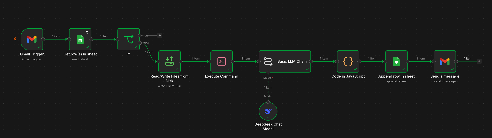

# Gmail Invoice Processing Automation

## Overview

This workflow automates the extraction of structured invoice data from PDF attachments received via Gmail.

It combines PDF text extraction, AI-powered information extraction, duplicate detection, and Google Sheets integration to transform unstructured invoice documents into searchable records.

The workflow prevents duplicate processing by tracking Gmail Message IDs.

## Workflow Architecture

**Figure 1:** Workflow that retrieves invoice PDFs from Gmail, extracts invoice data using DeepSeek, and stores the results in Google Sheets.

## Workflow Components

### Gmail Trigger

Monitors incoming emails and retrieves PDF invoice attachments.

### Google Sheets Lookup

Checks whether the email Message ID already exists in the invoice database.

### IF Node

Determines whether the email has been processed previously.

- Existing Message ID → workflow stops
- New Message ID → processing continues

### Read/Write Files from Disk

Stores the PDF attachment locally for text extraction.

### Execute Command (Poppler)

Uses the Poppler utility to extract raw text from the PDF document.

### Basic LLM Chain

Sends extracted invoice text to the language model and requests structured data extraction.

### DeepSeek Chat Model

Identifies and extracts the required invoice fields.

### JavaScript Processing

Parses the model response and enriches the output with the Gmail Message ID.

### Google Sheets Append Row

Stores the extracted invoice data in a structured format.

## Key Configuration Details

### Basic LLM Chain Prompt

The model is instructed to extract six invoice fields and return only valid JSON.

```text
Identify and extract the 6 key fields from the provided invoice text.

Fields to extract:
1. Supplier name
2. Order date
3. Order number
4. Supplier email
5. Total amount
6. Currency

Rules:
- Currency must be a 3-letter code, for example EUR, USD, GBP.
- Total amount must contain only the amount, without the currency symbol.
- Return JSON only.
- Do not use markdown.
- Do not use code blocks.
- Do not add explanations.

Use this exact JSON structure:

{
  "Supplier name": "",
  "Order date": "",
  "Order number": "",
  "Supplier email": "",
  "Total amount": "",
  "Currency": ""
}

Invoice text:
---
{{ $('Execute Command').item.json.stdout }}
---
```

### JavaScript Data Parser

The Code node converts the model output into a structured object and adds the Gmail Message ID for deduplication.

```javascript
// Get the JSON string from the Basic LLM Chain output
const raw = $input.first().json.text;

// Convert the JSON string into a real JavaScript object
const parsed = JSON.parse(raw);

// Get Gmail message ID for deduplication
const messageId = $("Gmail Trigger").first().json.id;

// Return clean fields for Google Sheets
return [
  {
    json: {
      "Supplier name": parsed["Supplier name"],
      "Order date": parsed["Order date"],
      "Order number": parsed["Order number"],
      "Supplier email": parsed["Supplier email"],
      "Total amount": parsed["Total amount"],
      "Currency": parsed["Currency"],
      "Message ID": messageId
    }
  }
];
```

### Google Sheets Schema

| Column         | Purpose                                       |
| -------------- | --------------------------------------------- |
| Supplier name  | Invoice supplier                              |
| Order date     | Invoice date                                  |
| Order number   | Invoice reference number                      |
| Supplier email | Supplier contact email                        |
| Total amount   | Extracted invoice amount                      |
| Currency       | Three-letter currency code                    |
| Message ID     | Gmail identifier used for duplicate detection |

## Data Flow

1. Gmail receives an email containing a PDF invoice.
2. The workflow retrieves the Gmail Message ID.
3. Google Sheets is queried for an existing Message ID.
4. If the Message ID exists, processing stops.
5. If no record exists, the PDF is written to disk.
6. Poppler extracts the document text.
7. DeepSeek analyzes the extracted text.
8. Invoice fields are returned as JSON.
9. JavaScript validates and formats the data.
10. The extracted fields and Message ID are stored in Google Sheets.

## Key Concepts Learned

- Event-driven workflow automation
- Gmail integration with n8n
- Google Sheets as a lightweight persistence layer
- Duplicate detection using Message IDs
- PDF text extraction with Poppler
- LLM-based information extraction
- JSON parsing and transformation
- End-to-end workflow orchestration

## Outcome

The workflow successfully:

- Processes invoice PDFs automatically
- Extracts structured business data from unstructured documents
- Prevents duplicate processing
- Stores invoice information in a searchable spreadsheet
- Reduces manual data entry effort

## Next Steps

- Add an AI Agent for more flexible invoice processing
- Support multiple invoice formats and languages
- Introduce invoice status tracking
- Add extraction confidence scoring
- Generate notifications for failed processing events
