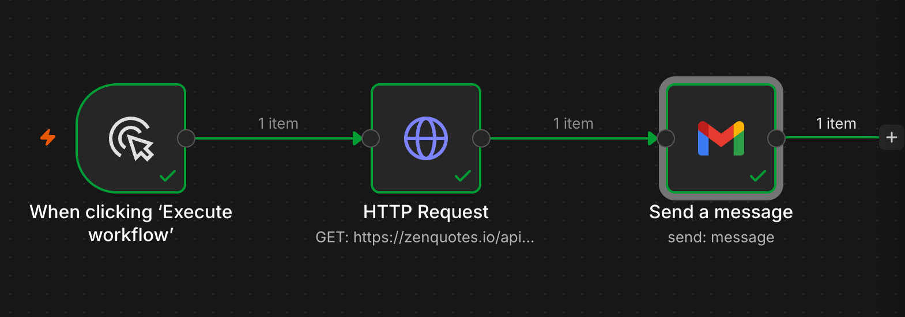

# Random Quote Email Automation

## Overview

This learning note documents my first workflow built with n8n.

The workflow retrieves a random quote from the ZenQuotes API and sends it via Gmail. It demonstrates how to connect external services, pass data between nodes, and automate a simple business process.

## Workflow Architecture



**Figure 1:** Workflow that retrieves a random quote from ZenQuotes and sends it by email.

## Workflow Components

### Manual Trigger

Starts the workflow during development and testing.

### HTTP Request

Calls the ZenQuotes API:

```text
https://zenquotes.io/api/random
```

and retrieves a random quote in JSON format.

### Gmail

Sends the quote to a configured email recipient.

The email body uses the expression:

```javascript
{{ $json.h }}
```

which references the HTML-formatted quote returned by the API.

## Data Flow

1. Manual Trigger starts the workflow.
2. HTTP Request retrieves a random quote.
3. Gmail reads the API response.
4. The quote is inserted into the email body.
5. The email is sent to the recipient.

## Key Concepts Learned

* Workflow triggers
* API integrations
* JSON data structures
* Expressions in n8n
* Passing data between nodes
* Email automation

## Outcome

The workflow successfully:

* Retrieved data from an external API
* Passed data between nodes
* Used dynamic expressions
* Sent automated emails through Gmail

## Next Steps

* Replace the Manual Trigger with a Schedule Trigger
* Send quotes automatically each day
* Store quotes in Google Sheets
* Add error handling and retry logic
* Enhance the workflow with AI-powered categorization
