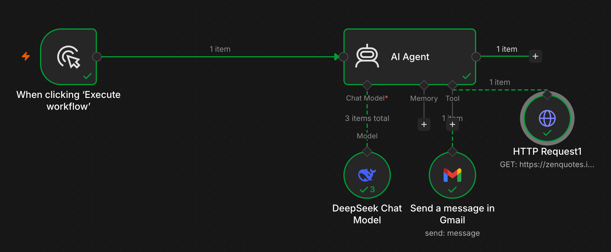

# AI Agent Random Quote Email

## Overview

This workflow uses an AI Agent to retrieve a random quote from the ZenQuotes API and send it via Gmail.

It demonstrates how an LLM can orchestrate external tools to complete a task.

## Workflow Architecture

** Figure 1:** AI Agent workflow that retrieves a random quote and sends it by email using external tools.

## Workflow Components

### Manual Trigger

Starts the workflow during testing.

### AI Agent

Receives the instruction:

```text
Send a random quote by email.
```

and decides which tools to use.

### DeepSeek Chat Model

Provides the reasoning capabilities for the AI Agent.

### HTTP Request Tool

Calls the ZenQuotes API:

```text
https://zenquotes.io/api/random
```

and retrieves a random quote and author.

### Gmail Tool

Sends the generated email to the configured recipient.

## Data Flow

1. Manual Trigger starts the workflow.
2. AI Agent receives the task.
3. DeepSeek calls the HTTP Request tool.
4. ZenQuotes returns a quote.
5. DeepSeek generates the email content.
6. Gmail sends the email.

## Key Concepts Learned

* AI Agents
* Tool calling
* DeepSeek integration
* HTTP API requests
* Gmail automation
* Prompt engineering

## Outcome

The workflow successfully:

* Retrieved data from an external API
* Used an AI Agent to select tools
* Generated email content dynamically
* Sent an email through Gmail

## Next Steps

* Add a Schedule Trigger
* Send daily quotes automatically
* Add memory to the agent
* Store quotes in Google Sheets
* Build agents with multiple tools
