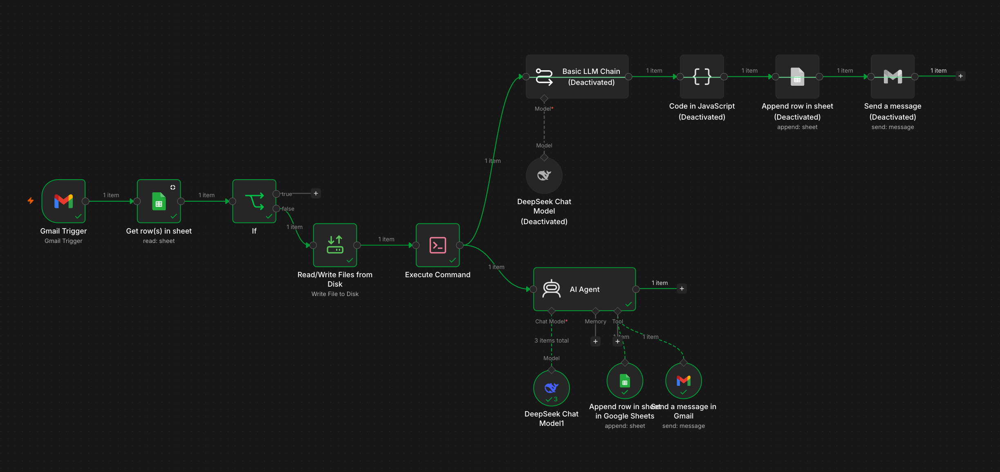
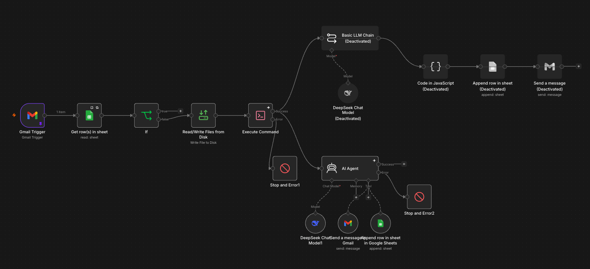
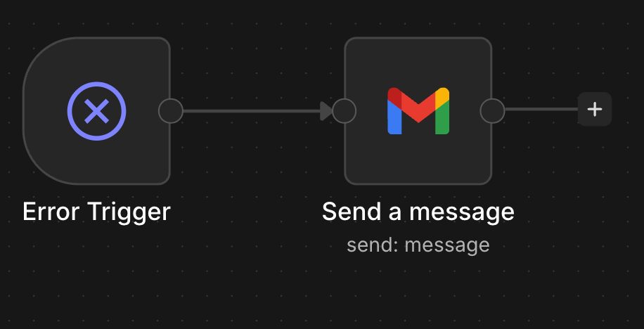

# Gmail Invoice Agent Automation

## Overview

This workflow automates invoice processing from Gmail PDF attachments using an AI Agent in n8n.

It extends the previous linear automation by replacing the Basic LLM Chain, JavaScript parser, Google Sheets append step, and Gmail notification step with an AI Agent that uses tools dynamically.

The workflow extracts invoice data, stores it in Google Sheets, sends a confirmation email, and prevents duplicate processing using Gmail Message IDs.

To improve operational reliability, the solution also includes a dedicated Error Workflow that automatically notifies administrators whenever a production execution fails.

## Workflow Architecture



**Figure 1:** AI Agent workflow that processes Gmail invoice attachments, extracts structured invoice data, stores it in Google Sheets, and sends a confirmation email.

## Workflow Components

### Gmail Trigger

Monitors incoming emails and retrieves PDF invoice attachments.

### Google Sheets Lookup

Checks whether the Gmail Message ID already exists in the invoice tracking sheet.

### IF Node

Determines whether the invoice has already been processed.

- Existing Message ID → workflow stops
- New Message ID → processing continues

### Read/Write Files from Disk

Stores the PDF attachment locally for text extraction.

### Execute Command

Uses Poppler to extract raw text from the PDF invoice.

### AI Agent

Acts as the main orchestration layer.

The AI Agent receives the extracted invoice text and decides how to use the available tools to complete the process.

### DeepSeek Chat Model

Provides the reasoning and language understanding capabilities for the AI Agent.

### Google Sheets Tool

Allows the AI Agent to append structured invoice data to Google Sheets.

### Gmail Tool

Allows the AI Agent to send a confirmation email after successful processing.

## Key Configuration Details

### AI Agent System Prompt

```text
You are an invoice processing assistant.

Your task is to process extracted invoice text and complete the workflow autonomously.

You must:

1. Extract the following invoice fields:
   - Supplier name
   - Order date
   - Order number
   - Supplier email
   - Total amount
   - Currency
   - Message ID

2. Append the extracted data to Google Sheets using these exact column names:

   - Supplier name
   - Order date
   - Order number
   - Supplier email
   - Total amount
   - Currency
   - Message ID

3. After successfully adding the row, send a confirmation email using the Gmail tool.

Extraction rules:

- Supplier name = company issuing the invoice.
- Order date = invoice or order date.
- Order number = invoice or purchase order reference.
- Supplier email = supplier billing or contact email.
- Total amount = numeric amount only, without currency symbols.
- Currency = 3-letter ISO currency code (EUR, USD, GBP, CHF, etc.).
- Message ID = Gmail message ID from the original email.

Email rules:

- Create a professional confirmation email.
- Include supplier name, order number, amount, currency, and message ID.
- Confirm that the invoice was successfully processed.

General rules:

- Do not ask the user questions.
- Use the available tools to complete the task.
- Complete all tasks in a single workflow execution.
```
### AI Agent User Prompt
```text

Process this invoice text:

{{ $('Execute Command').item.json.stdout }}

Original Gmail Message ID:

{{ $('Gmail Trigger').item.json.id }}
```

### Google Sheets Tool Configuration

The Google Sheets tool is configured to append a row to the invoice tracking sheet.

The following columns are populated by the AI Agent:

| Column         | Purpose                                       |
| -------------- | --------------------------------------------- |
| Supplier name	 | Company issuing the invoice                   |   
| Order date	 | Invoice or order date                         |
| Order number	 | Invoice or order reference number             |
| Supplier email | Supplier billing or contact email             |
| Total amount   | Invoice amount without currency symbol        |
| Currency	     | Three-letter currency code                    |
| Message ID	 |  Gmail identifier used for duplicate checking |

Each field is defined automatically by the model, with field descriptions added to guide the Agent.

### Gmail Tool Configuration

The Gmail tool sends a confirmation email after the invoice data has been added to Google Sheets.

The recipient is fixed, while the subject and message body are generated by the AI Agent.

The email includes:

- Supplier name
- Order number
- Total amount
- Currency
- Message ID
- Confirmation that the invoice was processed successfully

## Data Flow

1. Gmail receives an email containing a PDF invoice.
2. The Gmail Message ID is retrieved.
3. Google Sheets is checked for an existing Message ID.
4. If the Message ID exists, the workflow stops.
5. If the Message ID does not exist, the PDF is saved locally.
6. Poppler extracts text from the PDF.
7. The extracted text and Message ID are sent to the AI Agent.
8. The AI Agent extracts invoice fields.
9. The AI Agent uses the Google Sheets tool to append the invoice data.
10. The AI Agent uses the Gmail tool to send a confirmation email.
11. The workflow completes.

## Validation and Testing

The workflow was tested end-to-end using a sample invoice email containing a PDF attachment.

The expected Agent execution flow was:

```text
AI Agent
    ↓
Google Sheets Tool
    ↓
AI Agent
    ↓
Gmail Tool
    ↓
AI Agent
```

### Validation Objectives

The following behaviors were verified:

* The AI Agent successfully extracted invoice information from the PDF text.
* The Google Sheets tool appended a new invoice record.
* The Gmail tool sent a confirmation email.
* The Agent completed all required tasks without manual intervention.
* Duplicate prevention logic remained functional.

### Agent Execution Analysis

Execution logs were reviewed to validate:

* Tool invocation sequence
* Inputs and outputs exchanged between the Agent and tools
* Token consumption
* Processing duration
* Final workflow status

The logs showed that the Agent correctly coordinated multiple tool calls during a single execution.

### Observations

The Agent demonstrated flexibility when mapping extracted invoice information to Google Sheets columns.

Minor variations in field naming did not prevent successful data insertion, indicating that tool descriptions and prompt instructions provided sufficient context for the Agent.

### Improvement Opportunities

Potential future enhancements include:

- Standardizing invoice date formats before storage.
- Validating extracted invoice fields before writing to Google Sheets.
- Adding automatic retry mechanisms for transient failures.
- Logging workflow errors to a database or monitoring dashboard.
- Sending richer notification emails containing execution metadata.
- Supporting multiple invoice layouts and languages.

### Test Result

The workflow successfully:

* Processed a PDF invoice.
* Stored structured invoice data in Google Sheets.
* Sent a confirmation email.
* Completed all actions through AI Agent tool orchestration.

This validated the transition from a traditional LLM-based workflow to an Agent-based workflow capable of coordinating multiple business actions autonomously.

### Agent Execution Visibility

During testing, the Agent execution logs were inspected to verify tool orchestration.

The logs showed the Agent:

1. Extracting invoice information.
2. Calling the Google Sheets tool with structured invoice data.
3. Receiving confirmation that the row was appended.
4. Calling the Gmail tool to send a notification.
5. Completing the workflow successfully.

Depending on the n8n version, tool calls may appear either as explicit "Tool" entries or as "AI: Calling <Tool Name>" messages in the execution log. Both representations indicate successful Agent tool usage.

## Error Handling Architecture

### Purpose

The workflow includes centralized error handling to ensure that failures are immediately visible and do not silently stop the automation.

Instead of relying solely on execution logs, n8n automatically triggers a dedicated error workflow whenever a production execution fails.

This allows operational issues to be detected quickly and investigated before invoices are missed.



**Figure 2:** Error Handling Architecture

## Error Handling Workflow

A separate workflow named **Invoice Processing Error Handler** was created and configured as the Error Workflow for the main invoice processing workflow.

The error workflow contains:

```text
Error Trigger
    ↓
Gmail Send Message
```



![alt text] 
**Figure 3:** Invoice Processing Error Handler which is linked to the main workflow

### Error Trigger

The Error Trigger node listens for workflow failures generated by the main invoice processing workflow.

When a production execution fails, n8n automatically passes execution metadata and error information to the Error Trigger.

### Gmail Notification

After receiving the error event, the Gmail node sends an alert email containing information about the failure.

Typical information available includes:

- Workflow name
- Execution ID
- Error message
- Execution timestamp

This allows rapid investigation without manually monitoring workflow executions.

---

## Error Workflow Configuration

The error workflow was linked to the main workflow through:

```text
Workflow Settings
    ↓
Error Workflow
    ↓
Invoice Processing Error Handler
```

Once configured, any production failure in the invoice processing workflow automatically triggers the error handler.

---

## Error Handling Test

To validate the configuration, a failure was intentionally introduced.

The PDF storage path used by the **Read/Write Files from Disk** node was modified so that the target directory did not exist.

This generated the error:

```text
The file or directory does not exist
```

The execution failed as expected and the Error Workflow was triggered automatically.

The Error Trigger node received the failure event and successfully executed the Gmail notification step.

---

## Error Handling Observations

Several important behaviors were observed during testing.

### Manual vs Production Executions

Error workflows are designed primarily for production executions.

Manual testing from the editor may not always trigger the Error Workflow in the same way as a production execution.

For validation purposes, the workflow was tested using actual Gmail-triggered executions.

### Stop and Error Nodes

Dedicated Stop and Error nodes were added at critical stages of the workflow, including PDF storage, PDF text extraction, and AI processing, to generate explicit workflow failures when unrecoverable errors occur.

These nodes generate explicit workflow failures and improve visibility of operational problems.

### Centralized Monitoring

The dedicated Error Workflow provides a single location for monitoring failures across the automation.

This architecture can later be extended to:

* Microsoft Teams notifications
* Slack alerts
* Incident management systems
* Error logging databases

## Error Handling Validation Results

The following behaviors were successfully verified:

- The main workflow failed when an invalid file path was encountered.
- The configured Error Workflow was triggered automatically.
- The Error Trigger received the execution metadata.
- The Gmail node sent an error notification.
- Workflow failures became immediately visible without requiring manual inspection.

These results demonstrate how n8n separates business logic from operational monitoring through dedicated Error Workflows.

## Key Concepts Learned
- Agentic workflow design
- Tool-based automation in n8n
- AI Agent orchestration
- Dynamic use of Google Sheets and Gmail tools
- Prompt engineering for autonomous task execution
- Duplicate detection using Gmail Message IDs
- PDF text extraction with Poppler
- DeepSeek integration in n8n
- Difference between traditional and agent-based automation
- Centralized workflow error handling
- Error Trigger workflows in n8n
- Production execution monitoring
- Failure notification automation
- Operational observability for AI workflows

## Outcome

The workflow successfully:

- Processes invoice PDF attachments received through Gmail.
- Prevents duplicate invoice processing using Gmail Message IDs.
- Extracts structured invoice information using an AI Agent.
- Stores invoice records in Google Sheets.
- Sends automated confirmation emails after successful processing.
- Detects workflow failures through dedicated Stop and Error nodes.
- Automatically triggers a centralized Error Workflow.
- Sends email notifications whenever production failures occur.
- Demonstrates the transition from a linear workflow to an agent-based automation with centralized error handling.

## Next Steps

Potential future enhancements include:

- Add Agent memory for multi-step reasoning.
- Support multiple invoice formats and languages.
- Validate mandatory invoice fields before storage.
- Retry temporary failures automatically.
- Log workflow metrics and errors to a monitoring database.
- Integrate Slack or Microsoft Teams for operational alerts.
- Compare performance between the traditional LLM workflow and the AI Agent workflow.
