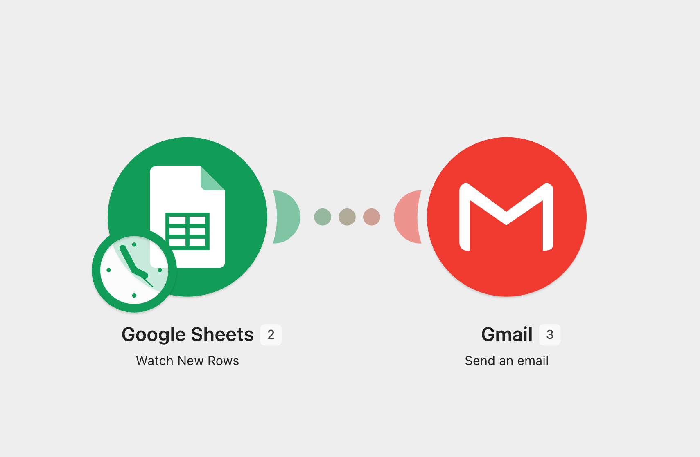

# Google Sheets → Gmail Automation (Make.com)

## Overview

This playground experiment demonstrates how to build a simple event-driven automation in **Make.com** using **Google Sheets** as the trigger and **Gmail** as the action.

The objective was to understand how Make.com monitors new records in a spreadsheet, maps dynamic data between modules, and executes automated notifications.

---

## Technologies

- Make.com
- Google Sheets
- Gmail
- Google Workspace OAuth
- Event-driven Automation

---

## Workflow

```
New Row in Google Sheets
            │
            ▼
     Gmail Send Email
```

---

## Configuration

- **Platform:** Make.com
- **Trigger:** Google Sheets – Watch New Rows
- **Action:** Gmail – Send an Email
- **Authentication:** Google Workspace OAuth
- **Data Mapping:** Dynamic spreadsheet fields mapped into the email body

---

## Workflow Design

The scenario monitors a Google Sheets spreadsheet for newly added rows.

Whenever a new record is detected, Make.com extracts the row values and automatically sends an email containing the user information.

Example spreadsheet:

| UserId | Name | Email | Message |
|--------:|------|-------|---------|
| 1 | Alice | alice@test.com | Welcome |

Example email:

```
Subject: New user added

A new user has been added.

User ID: 1
Name: Alice
Email: alice@test.com
Message: Welcome
```

---

## Result

This experiment successfully implemented:

- Google Workspace integration with Make.com
- Google Sheets trigger configuration
- Gmail module configuration
- Dynamic field mapping between modules
- Event-driven workflow execution

---

## Next Steps

This integration pattern can be extended to automate:

- User onboarding notifications
- Form submission alerts
- Spreadsheet-based business workflows
- Approval notifications
- AI-powered processing using LLM modules

---

## Screenshot

